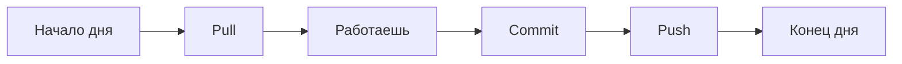

# Git Шпаргалка для Obsidian

## 🎯 Простое правило

```
Работаешь → Сохраняешь (Commit) → Отправляешь (Push)
Начинаешь день → Скачиваешь (Pull)
```

---

## 📋 Когда что делать

### 1. PULL — Скачать с GitHub
**Когда:** В начале работы, чтобы получить свежие изменения
```
Ctrl+P → "Git: Pull"
```

### 2. COMMIT — Сохранить изменения
**Когда:** Закончил работу над заметкой/задачей
```
Ctrl+P → "Git: Commit all changes"
```

### 3. PUSH — Отправить на GitHub
**Когда:** После commit, чтобы коллеги увидели
```
Ctrl+P → "Git: Push"
```

---

## 🔄 Ежедневный workflow



1. **Утром:** Pull (скачать новое)
2. **Работаешь:** Пишешь заметки
3. **Перерыв/Конец:** Commit + Push

---

## ⚠️ Частые вопросы

### "Everything is up to date"
**Значит:** Вы уже синхронизированы. Всё ок!

### "Please commit your changes"
**Значит:** Сначала сделайте Commit, потом Pull/Merge

### "Conflict"
**Значит:** Вы и коллега редактировали одно место. Надо выбрать чью версию оставить.

---

## 🚫 НЕ трогайте

- **Stage** — это промежуточный шаг, Obsidian Git делает его автоматически
- **Rebase** — сложная операция, не для начинающих
- **Force Push** — опасно, можно потерять данные

---

## ✅ Минимум для жизни

| Действие | Команда |
|----------|---------|
| Скачать | `Git: Pull` |
| Сохранить + Отправить | `Git: Commit all changes` → `Git: Push` |
| Отменить изменения | `Git: Discard all changes` |
